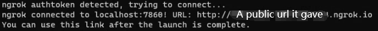

# Ngrok-in-StableDiffusion-tutorial
A tutorial for enable ngrok in stable diffusion

## Why you need to enable Ngrok in stable diffusion
Ngrok can help you generate a public url for sharing your stable diffusion webui for other device.
## How to enable Ngrok in stable diffusion webui
### Windows user
* edit your webui-user.bat

* get the [authtoken from ngrok](https://dashboard.ngrok.com/get-started/your-authtoken). If you don't have ngrok account you can register [here](https://ngrok.com/).
  * 

---
## There are two way to open Ngrok.

if you want only share url and don't need account system for protecting

* add ```COMMANDLINE_ARGS=--ngrok authtoken```
  * 

if you need account system use this

* add ```COMMANDLINE_ARGS=--ngrok authtoken:username:password```
  * 
---
* After edit and save bat file. Just run the bat. Remeber to use the latest ngrok.py to run it successfully.
  * if it successfully activate it will show this.
    * 
  * if you failed may see this.
    * 
    * pleaze check if you use the latest verion of [ngrok.py](modules/ngrok.py). Or the right format of ```COMMANDLINE_ARGS=--ngrok authtoken:username:password```. Or use the wrong authtoken.
    
* If you successfully activate. Open the url it gave you.
