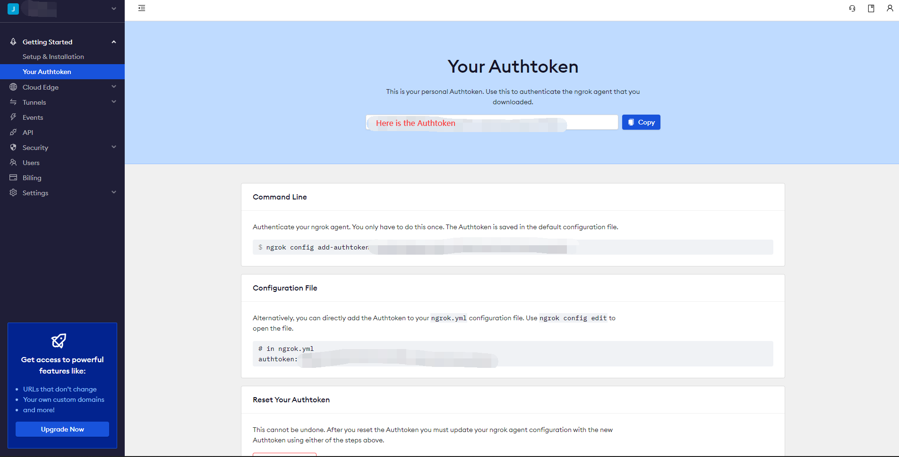
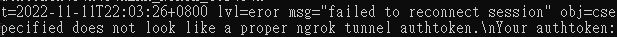

[English](README.md) | 繁體中文
# Ngrok StableDiffusion 教學
一個協助你開啟 Stable-diffusion 的 Ngrok 的教學。

## 為什麼你需要使用 Ngrok
Ngrok 可以幫助你生成一個公開網址分享你的 stable diffusion webui 可以在不同裝置上使用，也可以分享給其他人。

## [教學影片](https://youtu.be/Dgcz315UjbM)
你可以點擊下方圖片觀看[教學影片](https://youtu.be/Dgcz315UjbM)。

<a href="http://www.youtube.com/watch?feature=player_embedded&v=Dgcz315UjbM" target="_blank">
 
</a>

## 如何在 stable diffusion webui 開啟 Ngrok
### Windows 使用者
* 編輯你的 ```webui-user.bat```

* 取得 [Ngrok 的 Authtoken金鑰](https://dashboard.ngrok.com/get-started/your-authtoken). 如果你沒有 Ngrok 的帳號，可以在 [Ngrok的網站](https://ngrok.com/) 註冊。底下的紅字區域就是你的金鑰。
  * 

---
## 在 stable-diffusion-webui 中有兩種方式開啟 Ngrok.

如果只是單純需要一個公開網址，可以直接使用下面的指令

* 在 webui-user 中更改成 ```COMMANDLINE_ARGS=--ngrok 你的Ngrok金鑰``` 如下圖
  * 

如果需要帳號密碼防護，則可以使用下方指令

* 更改成這個格式 ```COMMANDLINE_ARGS=--ngrok 你的Ngrok金鑰:使用者名稱:密碼``` 如下圖
  * 
---
* 修改並保存```webui-user.bat```後。直接使用bat檔。記得使用最新的 ```ngrok.py``` 我有[附於此文檔](modules/ngrok.py)，才能夠成功跑加了帳號密碼的方式。
  * 如果成功，會顯示下圖。可以取得所需要的公網網址。
    * 
  * 如果失敗，則會看到下圖。記得檢查有沒有用最新的 [ngrok.py](modules/ngrok.py)。或是指令格式錯誤 ```COMMANDLINE_ARGS=--ngrok authtoken:username:password```。或是填入錯誤的使用者金鑰。
    * 
    
* 如果成功跑完 bat。打開它給你的公網網址。
 * 會看到底下這個頁面，按 visit site 進入。
 * 
   * 如果先前有設定帳號密碼，會看到下圖。
   * 
   * 需要輸入先前設定，正確的 ```使用者名稱``` 和 ```密碼``` 進入。如果進入後只有空白頁面，可以刷新頁面清除快取，就會有正常的頁面。
* 最後。 會看到 Stable diffusion webui 頁面，已經可以正常使用。 
 * 
## 為甚麼我想做這個教學
關於如何分享網址和有關 Ngrok 的內容很少。需要翻 webui 文檔，但資訊也不多。我覺得 Ngrok 比另一種方式來得安全，網址隨機產生的位數更多，也能設定帳號密碼，不過 webui 的 Ngrok 的帳號密碼設定是缺失的，所以我補上了這部分的代碼。
我也在 [stable-diffusion-webui](https://github.com/AUTOMATIC1111/stable-diffusion-webui) 發了一篇 [ppull request](https://github.com/AUTOMATIC1111/stable-diffusion-webui/pull/4563) 有關於 Ngrok 的帳號密碼。原作者 [AUTOMATIC1111](https://github.com/AUTOMATIC1111) 已經通過了這個請求。將我的代碼整合到 webui 裡面。

這是我的榮幸，可以在如此龐大的項目中留下自己的代碼。而自己寫的功能若無法被使用，則是我很遺憾看到的，所以我做了這篇教學。


